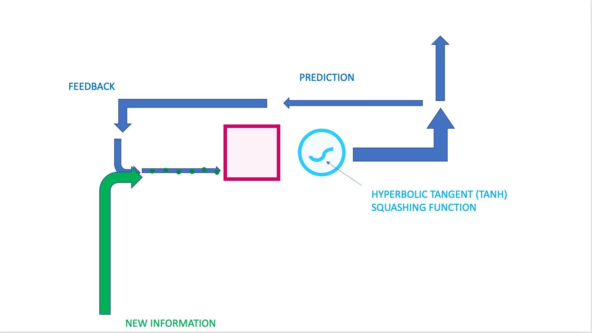

# Assignment 10: Recurrent Neural Networks (RNN's)

Adapted by Mark Sherman <shermanm@emmanuel.edu> from MIT 6.S198 under Creative Commons
Emmanuel College - IDDS 2132 Practical Machine Learning - Spring 2021

This assignment is based on work by Kevin Zhang, Harini Suresh, Wendy Wei, Martin Schneider, Natalie Lao, and Hal Abelson. Updated by Alyssa Hogan. New diagrams by Alyssa Hogan.

# 0. Introduction to RNN's

In this assignemnt, we will focus on modeling sentences using an example of an RNN. Below is the diagram of an RNN (Figure 1) to use as reference throughout the assignment. This assignment involves training small networks, although you may find that it still takes about 10~15 minutes for the training to complete. 

Figure 1: 



# 1: Text Generation

Text classification was an example of a "many-to-one" type of RNN, where many inputs (words in a sentence) are turned into one output (the classification label). Now we introduce a "many-to-many" RNN, which we will call a sequence-to-sequence RNN. Commonly used in machine translation, sequence-to-sequence RNN's can be used to generate text. Given a sequence of words, an RNN can predict the probability of the next word, and so intuitively, a generative RNN chooses the most likely next word again and again as it builds a sentence.

To get intuition on how the training works, play around with this interactive demo by Andrej Karpathy in your browser: <https://cs.stanford.edu/people/karpathy/recurrentjs/>. This demo generates new sentences character by character, using user-provided data from the input text box. To use the demo, press learn/restart in the controls section and look at the "sentences" generated in the Model Samples section. You can use Pause and Restart to make the output easier to follow. Note that the modeling happens character by character: any actual words produced are because the character sequence was learned, and there are lots of strings that are not words. The button at the bottom lets you load a pretrained model so you can see what output would look like after 100 hours of training.

For homework, we will experiment with generating sentences using at least two input datasets to train a single model. Our goal is to generate texts that combine the different styles of our input datasets. One amusing example of this is "King James Programming", trained using input from the King James Bible mixed with Abelson and Sussman's "Structure and Interpretation of Computer Programs": <http://kingjamesprogramming.tumblr.com/>. (The output shown here was generated with a Markov chains rather than an RNN.)

An example of what King James Programming bot saith:

"commutativity of addition is a single theorem because it depends on the kind of unholy rapport he felt to exist between his mind and that lurking horror in the distant black valley."

"hath it not been for the singular taste of old Unix, "new Unix" would not exist."

## 1.1 Setup

We will use a modified version of the Karpathy's demo code, written in RecurrentJS, which is a Javascript library (different from Deeplearn.js) that implements RNNs and LSTMs. 

* Clone this assignment. 
* Open the assignment folder in Visual Studio Code.
* This assignment uses a docker container to provide linting tools. Re-open in container to use them.
* Use the Live Server plugin to "Go Live" - which will open a browser window.
* In the browser, click `index.html`

The demo will come up when you open the page. As usual also open the browser developer tools Javascript console to help you see what is happening.

### IMPORTANT GIT THING
If you are using a lab machine, or a computer for the first time, you have to tell git on that computer who you are, even though it knows you well enough to clone and push your code. Do this in a terminal:
```bash
git config user.name "Your Realname"
git config user.email "yourEmail@thatYouUseForGit.edu"
```

Note: Slightly different from the previous assignments this semester, the Javascript code here is embedded in the html file rather than loaded as a separate file. To make changes, just edit the html file and reload the page. 

*Pro Tip:* the Live Server plugin for VSC automatically reloads whenever you save the file! One less step!

## 1.2 Complete the Code

If you load the code as is, you will get errors. To fix the errors, you'll need to complete the code at line 273 marked TODO.\
This requires uncommenting the two declarations of the variable out_struct (one for RNNs and one for LSTMs) and filling in the missing arguments to `R.forwardRNN` `R.forwardLSTM`, the functions that perform the forward propagation through one cell of the RNN or LSTM

Hint: The 5 arguments to be filled in are the same in both places. They are (in order):
- the graph G
- the model
- [hidden_sizes], the list of sizes of the hidden layers
- the input row to the cell, here denoted x
- the previous cell, here denoted prev

If you fill in these inputs and refresh the page, things should load without error: The LSTM model should start to run and you should start seeing output generated toward the bottom of the page.

Note: Documentation on RecurrentJS is here: <https://github.com/karpathy/recurrentjs>

## 1.3 Run the model

### Problem 1 - WRITEUP REQUIRED
1\. Run the model for 10 to 15 epochs, or until you see interesting results. Pause the model and record the perplexity. Perplexity is a measurement of how well the model predicts a sample. A low perplexity indicates that the model is good at making predictions.

> What is the perplexity? what does this value indicate to you?

### Problem 2 - WRITEUP REQUIRED
2\. Adjust the softmax sample temperature, and continue training for a few samples. Softmax sample temperature is a hyperparameter that determines how softmax computes the log probabilities of the prediction outputs. If the temperature is high, the probabilities will go toward zero and you will see less frequent words. If the temperature is low, then you will see more common words, but there may be more repetition. Try to find a temperature that produces the most natural seeming text, and give some examples of your generated sentence results.

> What temperature did you find? Show examples of results. 

### Problem 3 - WRITEUP REQUIRED
3\. Write down any observations about your generated sentence results. Does your text reflect properties of the input sources you used (i.e. vocabulary, sentence length)?

> observations

### Problem 4 - WRITEUP REQUIRED
4\. Try changing the model parameters and initialization. Record your observations from at least one of these experiments. Some ideas are:
- Increase or decrease the embedding size for the inputs
- Increase or decrease the size of the hidden layers of each cell
- Adjust the learning rate (Be careful: if the learning rate is too high, the perplexity may explode.)
- Change the generator from LSTM to RNN.

> Document what you tried, what you expected, and what you observed. Include any other notes of relevance.

### Problem 5* - Run with new data (Optional)

The code is preloaded with data. But you can download data of your choice to run this with, such as from <https://www.kaggle.com/paultimothymooney/poetry/data>.

Just make sure each "sentence" is on a different line.

> What new database did you load? Take a few screenshots of some sentences you were able to create.

# Submission
Commit and push your changes to this repository.
